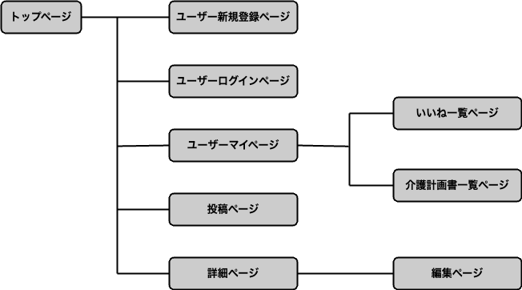

# アプリケーション名
CAREPLAN-FRAME

# アプリケーション概要
介護計画書をシェアし、ユーザー同士でコミュニケーションをとることで励まし合える

# 利用方法
## 介護計画書投稿
1.トップページのヘッダーからユーザーの新規登録を行う  
2.新規登録ボタンから、介護計画書の内容（タイトル・解説・利用者の意向・援助の方針）を入力し投稿する  

## 投稿者を励ます
1.トップページから詳細をクリックして、介護計画書の詳細を確認する  
2.いいと思った介護計画書があれば、いいね・コメントでメッセージなどを行う

# アプリケーションを作成した背景
プログラミングを学習中に、基本原則に沿ったコーディングする事が重要だと認識しました。
しかし、ケアマネジャー実務経験が浅い時を振り返ると、計画書作成の基本原則が定まっておらず、非効率な文章作成と情報収集をしていました。
そこで、計画書を投稿・閲覧できるアプリケーションを開発し、実務経験が浅いケアマネジャーにインプット場を提供したいと考えました。

# 洗い出した要件
[要件を定義したシート](https://docs.google.com/spreadsheets/d/1pVzzND62P_e_ogERzu7N9Ayv4SeMqQrtdltsYSqc4ms/edit#gid=665557150)

# データベース設計

# 画面遷移図

# 開発環境
- フロントエンド  
  - Ruby
  - Ruby on Rails
- インフラ
  - Git Hub
- テキストエディタ
  - Visual Studio Code